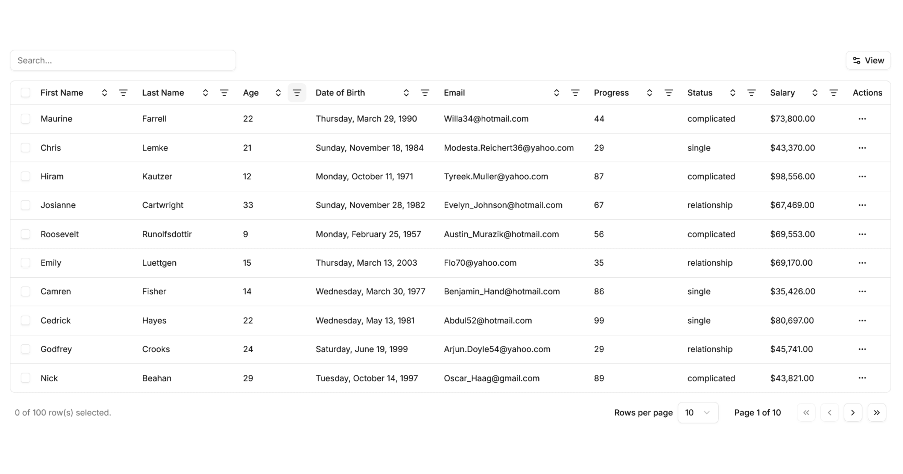

# shadcntable

> ⚠️ **Beta Notice:** shadcntable is currently in beta. APIs may change between releases. We encourage you to try it out and [share feedback](https://github.com/LGLabGreg/shadcntable/issues)!

A powerful, accessible, and fully customizable data table component for your React application. Open source and ready to drop into your project.

## Documentation

Visit the [documentation](https://shadcntable.com/docs/getting-started/installation) to get started.

## Contributing

Please read the [contributing guide](/CONTRIBUTING.md).

## License

Licensed under the [MIT license](https://github.com/LGLabGreg/shadcntable/blob/main/LICENSE.md).
